# FitnessX

O **FitnessX** é um aplicativo de fitness interativo e envolvente, projetado para simular animações de uma aplicação mobile real.

## Visão geral do projeto

O **FitnessX** é um aplicativo incrível desenvolvido usando o framework **React Native** e **Expo**. Este projeto tem como objetivo principal demonstrar o poder das animações no React Native, especialmente utilizando as bibliotecas **react-native-reanimated** e **react-native-skia**.

<table>
  <tr>
    <td>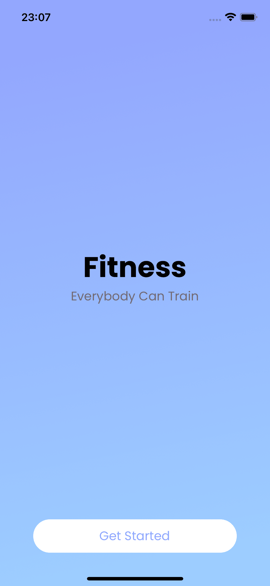</td>
    <td>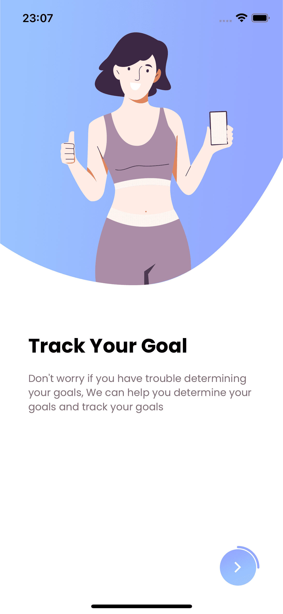</td>
    <td>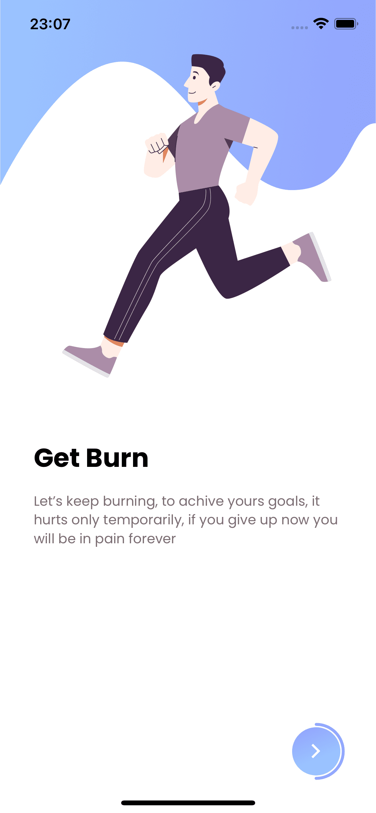</td>
  </tr>
  <tr>
    <td></td>
    <td>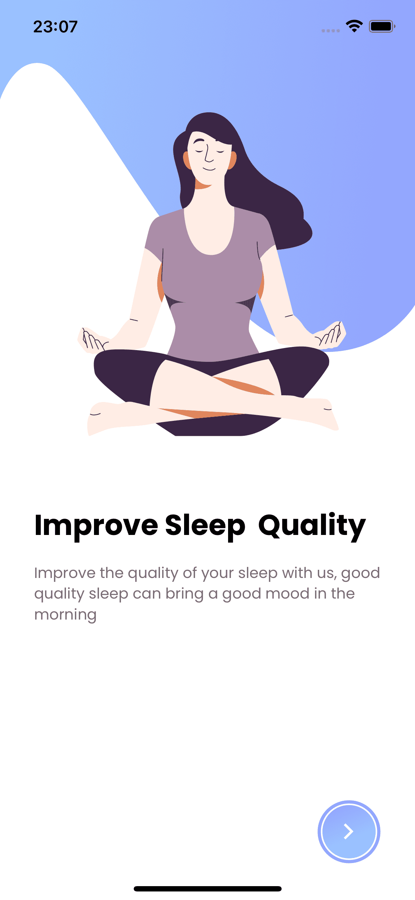</td>
    <td>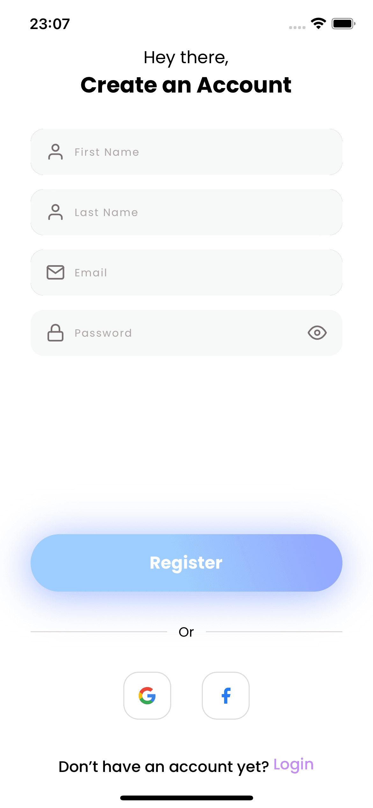</td>
  </tr>
  <tr>
    <td>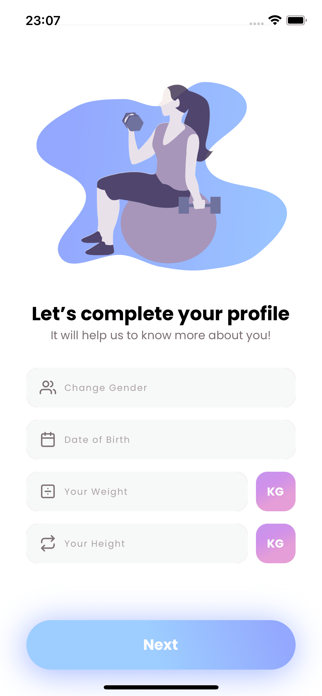</td>
    <td>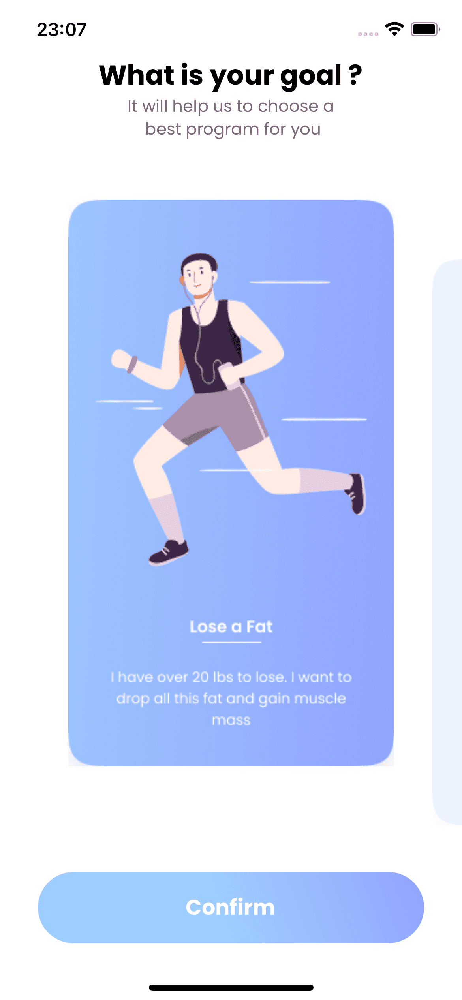</td>
    <td>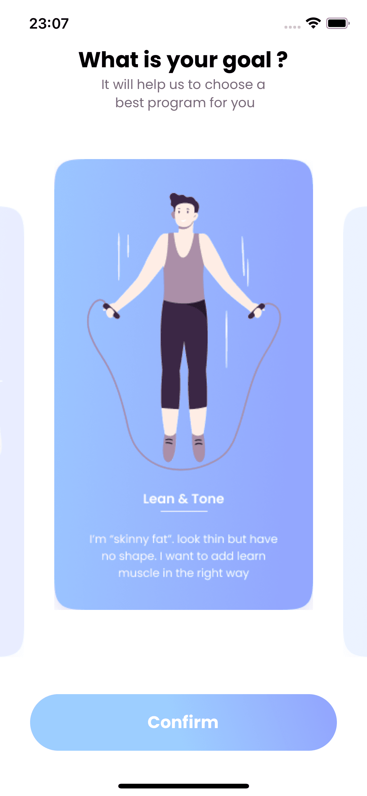</td>
  </tr>
  <tr>
    <td>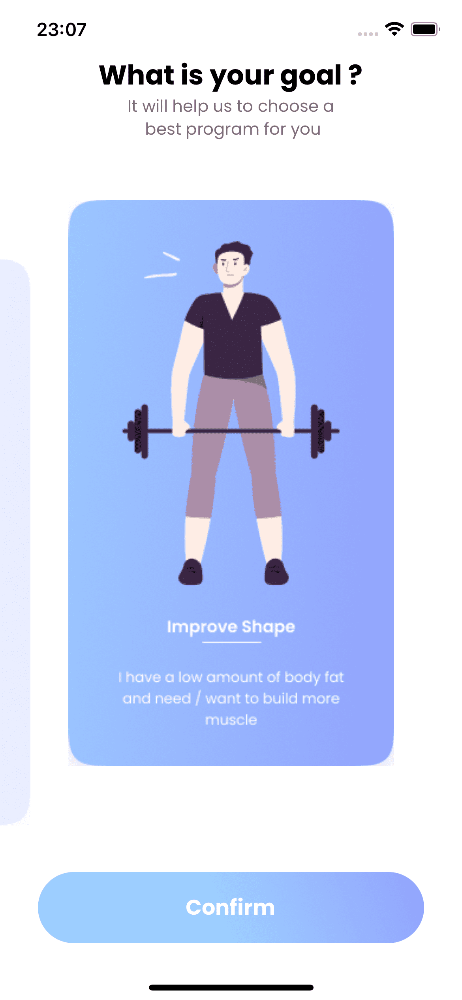</td>
    <td>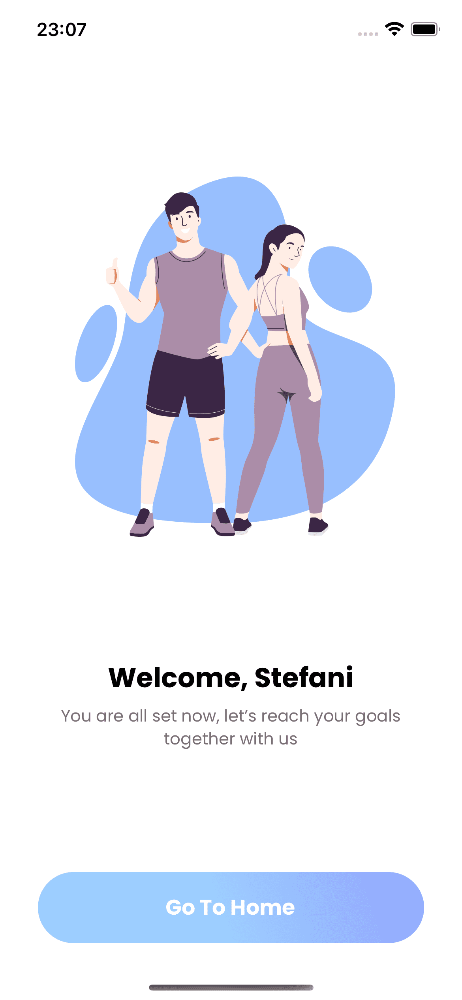</td>
    <td>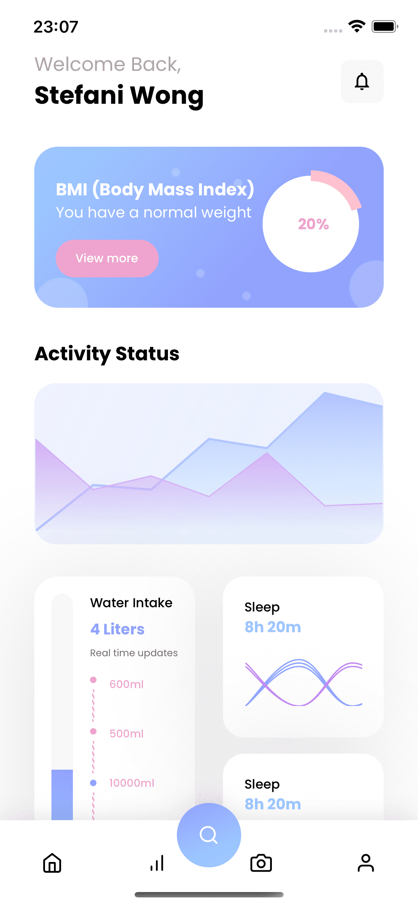</td>
  </tr>
</table>

## Recursos principais

- **Animações Avançadas:** O destaque deste projeto é a utilização extensiva da biblioteca **react-native-reanimated** para criar animações fluidas e realistas. Desde transições suaves entre telas até interações de elementos da interface, as animações neste aplicativo proporcionam uma experiência de usuário envolvente e interativa.

## Pré-requisitos e Instalação

Antes de começar, você precisa ter o Expo CLI instalado em sua máquina. Siga as etapas abaixo para executar o **FitnessX** localmente:

Clone este repositório:

```git clone https://github.com/gustavo-sorati/fitness-x.git```

Navegue até o diretório do projeto: cd fitness-x e instale as dependências:

```npm install```

Inicie o aplicativo:

```expo start```

Certifique-se de ter um dispositivo Android ou iOS simulador/emulador configurado para visualizar o aplicativo em execução.

## Contribuição

Se você deseja contribuir para este projeto e aprimorar ainda mais as animações, adicionar novos recursos ou corrigir problemas, fique à vontade para enviar pull requests. Certifique-se de seguir as diretrizes de contribuição do projeto.

## Licença

Este projeto está licenciado sob a Licença MIT. Consulte o arquivo LICENSE para obter mais informações.

Se tiver alguma dúvida ou sugestão, sinta-se à vontade para abrir uma issue neste repositório. Divirta-se e mantenha-se saudável! 💪🏃‍♀️🏋️‍♂️

